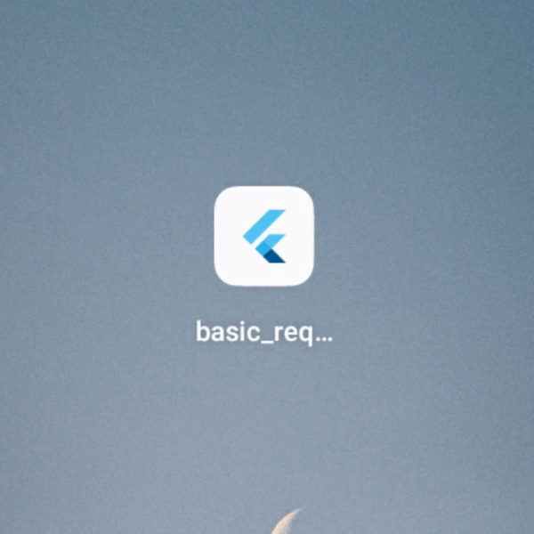
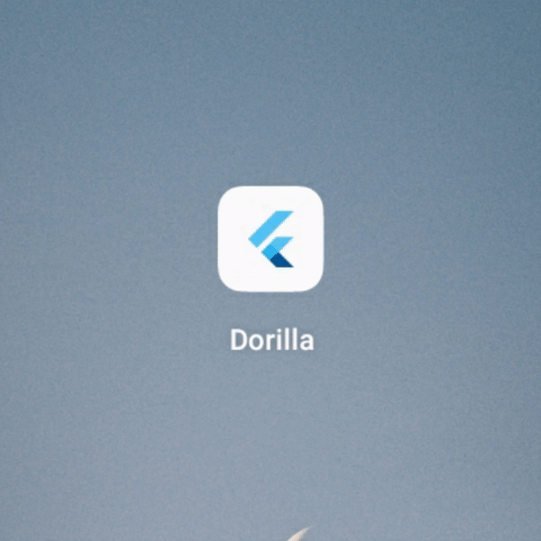
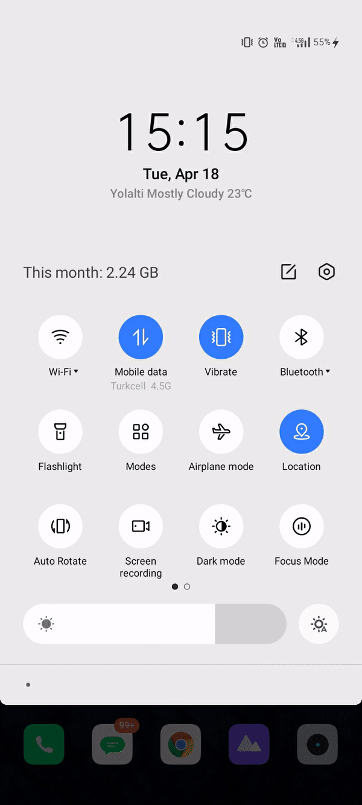

basic requirements package

- Change app name
- add app icon
- splash screen
- introduction page
- theme
- localization
- rouiting

<br>
<br>
<br>

## Change App Name

<details style="margin:15px">
  <summary style="font-size:20px"> Usage</summary>
  
#### Android

Go to android manifest.xml.

```
android / app / src / main / AndroidManifest.xml
```

Change android label with your app name.

```
<application
          android:name="io.flutter.app.FlutterApplication"
          android:label="App Name"
          android:icon="@mipmap/launcher_icon">
```

#### Ios

Go to Info.plist.

```
ios / Runner / Info.plist
```

Change bundle name with your app name.

```
<key>CFBundleName</key>
<string>App Name</string>
```

</details>

<p>
  
</p>

## Change App Icon

<details style="margin:15px">
  <summary style="font-size:20px"> Usage</summary>
  
#### Android & Ios

Add last version of flutter_launcher_icons package in dev_dependencies.

```
dev_dependencies:
  flutter_launcher_icons: "^0.13.0"
```

Add your app icon pubspec.yaml/assets.

```
assets:
    - assets/icon/icon.png
```

Add your Flutter Launcher Icons configuration to your pubspec.yaml

```
flutter_icons:
  android: true
  ios: true
  image_path: "assets/icon/icon.png"

```

İf you want to change icon also web, windows, macos then add this:

```
web:
    generate: true
    image_path: "path/to/image.png"
    background_color: "#hexcode"
    theme_color: "#hexcode"
  windows:
    generate: true
    image_path: "path/to/image.png"
    icon_size: 48 # min:48, max:256, default: 48
  macos:
    generate: true
    image_path: "path/to/image.png"
```

After setting up the configuration, run the package.

```
flutter pub get
flutter pub run flutter_launcher_icons
```

</details>

<p>
  
</p>

## Splash Screen

<details style="margin:15px">
  <summary style="font-size:20px"> Usage</summary>
  
#### Android & Ios

Add last version of flutter_native_splash package in dev_dependencies.

```
dependencies:
  flutter_native_splash: ^2.2.19
```

Add your app logo pubspec.yaml/assets.

```
assets:
    - assets/logo/
```

Add your Flutter Native Splash configuration to your pubspec.yaml

```
flutter_native_splash:
  color: "#dcd5cd"
  image: assets/logo/logo.png
  color_dark: "#1b1106"
  image_dark: assets/logo/logo_dark.png

  android_12:
    image: assets/logo/logo.png
    icon_background_color: "#dcd5cd"
    image_dark: assets/logo/logo_dark.png
    icon_background_color_dark: "#1b1106"

  web: false
```

After setting up the configuration, run the package.

```
flutter pub get
flutter pub run flutter_native_splash:create
```

</details>

<p>
  
</p>
